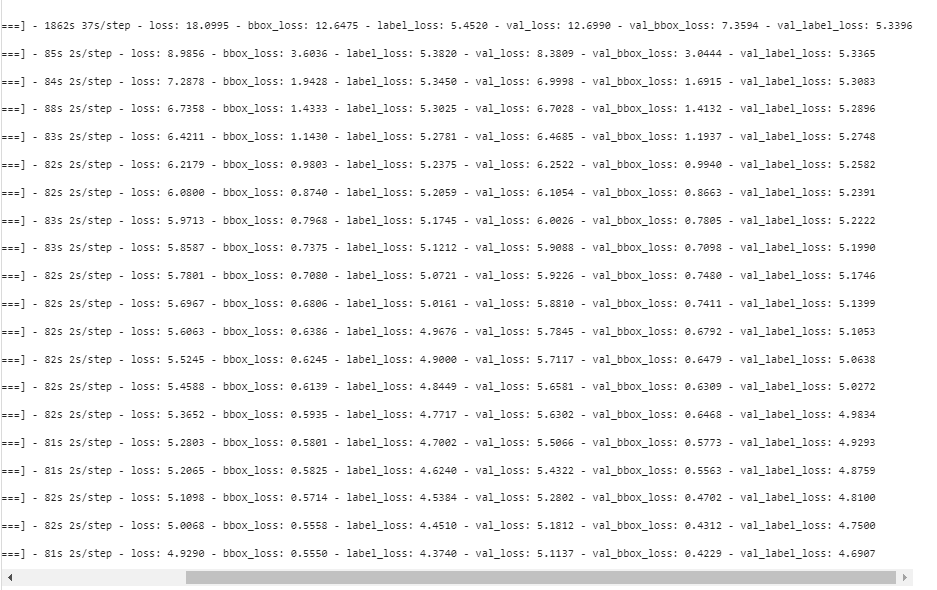
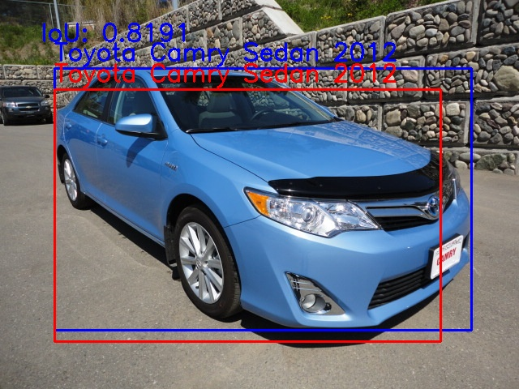
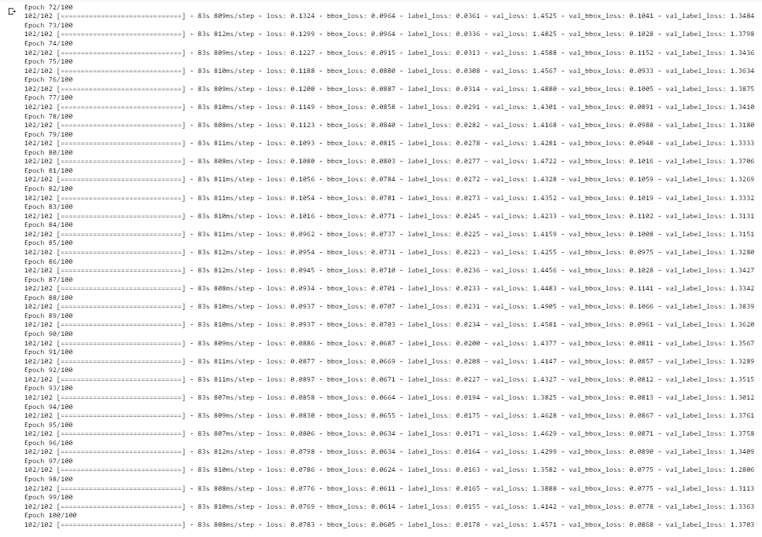

# [TF] Car Classification and Localization using MobileNetV2 as backbone

## Introduction

In this project, I want to make a model that can classify and draw a bounding box on a car for each image, based on the Stanford Car Dataset. The model uses MobileNetV2 as backbone, and I created 2 heads for 2 tasks which are classification and localization. I also gained experience in using a pipeline for the training process.

## Motivation

After working on the multi-task model for MNIST dataset, I want to try working with a bigger architecture and bigger dataset. Even though there are many other object detection repositories online, the reason I worked on this project is to have experiences in working with data in preprocessing and creating a data pipeline to prepare for the training process. In addition, this data pipline can also be used for other projects that have similar dataset formats.

## Datasets:

| Dataset                | Classes |    #Train images      |         #Test images       |
|------------------------|:-------:|:---------------------:|:--------------------------:|
| Stanford Car Dataset   |   196   |         8144          |           8041k            |
  
- **Stanford Car Dataset by classes folder**:
  I chose this dataset because I wanted to work on creating a data pipeline for training, but wanted to choose a dataset that has a clear way of structuring the folders. Also, this dataset has a decent ammount of images for training so the model does not overfit.
  
  The dataset is from Kaggle and contains 16,185 images of 196 classes of cars. The data is split into 8,144 training images and 8,041 testing images, where each class has been split roughly in a 50-50 split. Classes are typically at the level of Make, Model, Year, e.g. 2012 Tesla Model S or 2012 BMW M3 coupe.
  
  There are 3 csv files coming with the dataset. The anno_train.csv and anno_test.csn contain the information of the label and bounding boxes for each image. However, the labels are only numbers, so the names.csv file maps the label index with the name of the car.
  
  For training, I split the training set into 80% for training and 20% for validation.
  
  The dataset can be downloaded at: https://www.kaggle.com/datasets/jutrera/stanford-car-dataset-by-classes-folder?resource=download
  
  NOTE:  In the name.csv file, change the "Ram C/V Cargo Van Minivan 2012" row 174 in the file to "Ram CV Cargo Van Minivan 2012" (get rid of '/'). THe reason is '/' is a special character and causes problem when readding the file name as a path. In addition, go to the "train" and "test folder and change the name of the folders accordingly.
  
## Model architecture
The model takes in input images of shape 256x320. For the backbone, I imported the MobileNetV2 from tensorflow.keras.applications library without the head layer. I set the weights as pretrain weights from ImageNet. At the last layer, I added in a Convolutional layer, a Batch Normalization layer, ReLU activation layer, a Global Average Pooling layer, and a DropOut layer with dropout rate of 0.5.

From there, I created 2 heads for the classification task and the localization task. Localization task is a Dense layer with 4 nodes and sigmoid activation function. Classification tasks is a Dense layer with 196 nodes which is the number of classes and a softmax activation function.

## Experiments and Results

Here are some hyperparameters I use in the training:  
seed = 42 \
batch_size = 64\
num_epochs = 5\
learning_rate = 0.0001

When testing, my model achived mean IOU of 0.7713, which is a decent result after only 5 epochs. The accuracy is 14.1%. However, this does not mean that the model cannot learn this dataset. Looking at the loss values for label during training, we can see that it was going down and it can still going down more if we train for more epochs. In addition, I can use weighted sum method for calculating the total loss so the model will focus more on the classification task.

   
  <i>Loss results .</i>

Overall, classifying car names can be a difficult task which requires the model to learn specific details of each car's brand. Therefore, training with a large number of epochs is important. However, my computer took a long time for only 5 epochs (half a day) so the classification result was low. But looking at the loss values in the training, I believe training for more epochs will have significantly better results.

The results during testing can be seen in the Results folder.

   
  <i>Example of a correct result.</i>

UPDATED: I increased the epochs to 100 and trained on a better GPU, the accuracy increased to 68.4% and mean IOU increased to 0.8542. That prooved my theory that training for more epochs helps. The results in this second attempt can be seen in the results_100epochs folder

   
  <i>Better loss values after longer training.</i>

## Discussion and future works
This project gained me a lot of experience in creating a data pipeline to prepare data for training. Besides, I learned more about working with multi-tasking models. This project can be expanded with more datasets with similar setup of data folders.
